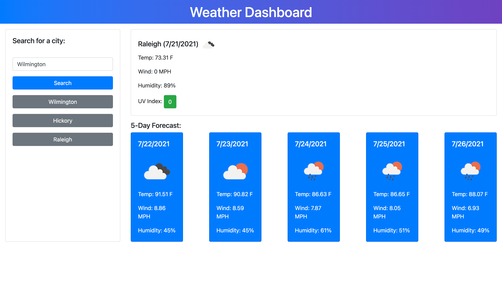

# weather-dashboard

Weather dashboard that displays the current weather and 5-day forecast for whichever city user inputs.

## Functionality

* User can input any city into search bar.

* Dashboard will display weather conditions, temperature, humidity, wind speed, and UV index for selected location.

## Features

* Dynamically created HTML elements.

* Fetches from two different APIs.

* Utilization of local storage to save user search history.

## Link to Application 

https://laurenlgoss.github.io/weather-dashboard/

## Screenshot of Application

## Developer Contact Information

* Phone: (828)409-3012

* [Email](laurenlgoss98@gmail.com)

* [LinkedIn](https://www.linkedin.com/in/laurenlgoss/)